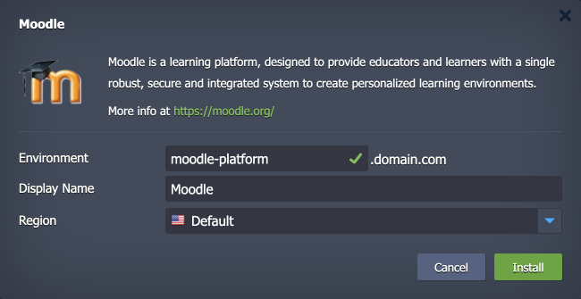

 

# Moodle

The package deploys the [Moodle](https://moodle.org/) solution - an open-source online learning management system enabling educators to create their own private website filled with dynamic courses that extend learning, any time, anywhere. Moodle provides administrators and learners with a single robust, secure, and integrated system to create personalized learning environments.

## Environment Topology

This package creates a dedicated Moodle environment that contains one application server and one database container. It automatically deploys and sets the Moodle application. The automatic vertical scaling is enabled out of the box, and [horizontal scaling](https://www.virtuozzo.com/application-platform-docs/automatic-horizontal-scaling/) can be configured (if needed). The default software stacks utilized in the package are the following:

- Apache 2 PHP application server (PHP 8.3)
- MySQL 8 database
- Moodle 4.5

## Deployment to Cloud

To get your Moodle solution, click the "**Deploy to Cloud**" button below, specify your email address within the widget, choose one of the [Virtuozzo Public Cloud Providers](https://www.virtuozzo.com/application-platform-partners/), and confirm by clicking **Install**.

> If you already have a Virtuozzo Application Platform (VAP) account, you can deploy this solution from the [Marketplace](https://www.virtuozzo.com/application-platform-docs/marketplace/) or [import](https://www.virtuozzo.com/application-platform-docs/environment-import/) a manifest file from this repository.

## Installation Process

In the opened installation window at the VAP dashboard, provide a preferred environment and display names, choose a region (if available), and confirm the installation.

Your Moodle application will be automatically installed in a few minutes.
